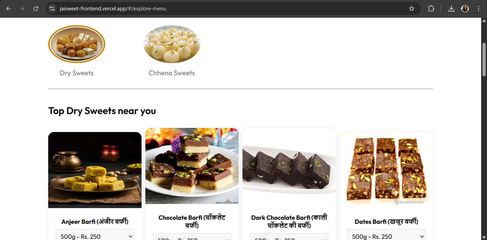

# 🧁 JaiSweet Frontend

**JaiSweet** is a modern, responsive frontend for an e-commerce platform focused on sweets and restaurant items. Built with love and sugar, this platform helps users browse, filter, and order a wide variety of delicious items from nearby restaurants or sweet shops.

---

## 🔗 Live Demo

[👉 View JaiSweet Frontend ](https://jaisweet-frontend.vercel.app/)

---

## 🖼️ Features

- 🍬 Beautifully designed homepage with featured sweets and restaurants
- 📋 Category-wise filtering (Sweets / Restaurant)
- 🛒 Shopping cart functionality
- 🏪 Restaurant selection dropdown
- 🎂 Sweet item and food listing with image, price
- 🧾 Checkout process (can be integrated with Razorpay)
- 🔐 Authentication support (Login / Register / Logout)
- 📱 Fully responsive for mobile, tablet, and desktop

---

## 🚀 Tech Stack

- **Frontend Framework:** React.js
- **UI Framework:** Tailwind CSS 
- **State Management:** Context API 
- **Routing:** React Router DOM
- **API Integration:** Axios or Fetch
- **Other:** 
  - Sweet Alert for notifications
  - React Icons
  - React Dropdown or Select for filters

---

## Screenshots

To provide a better understanding of the Student Study Portal application, here is a screenshot:

##Home Interface

##About Interface

##Menu Interface

##Contact Interface

##Cart Interface

##SignUp Interface

##SignIn Interface

##Order Interface

##Footer Interface

